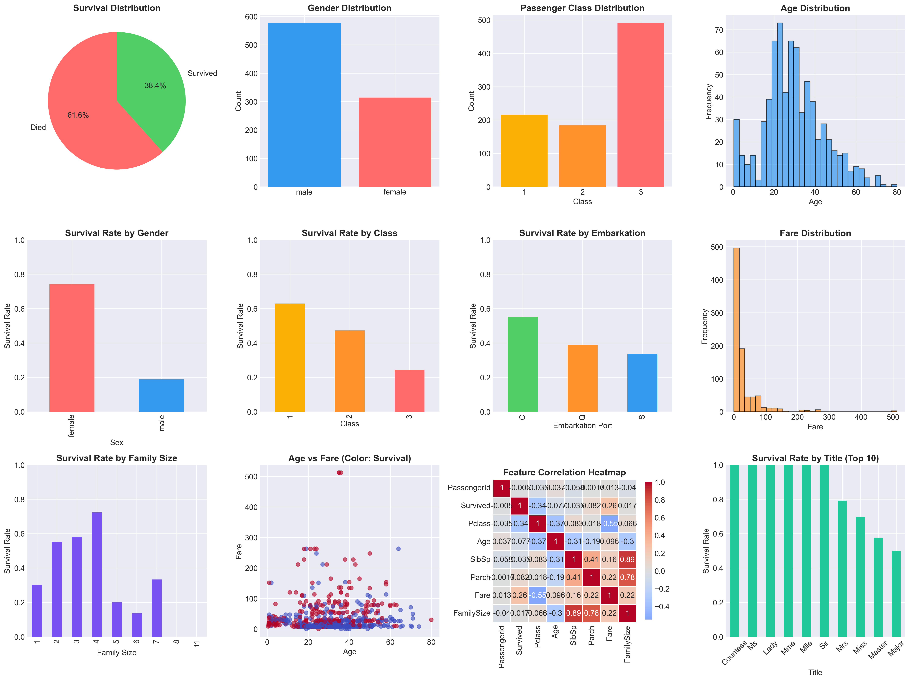
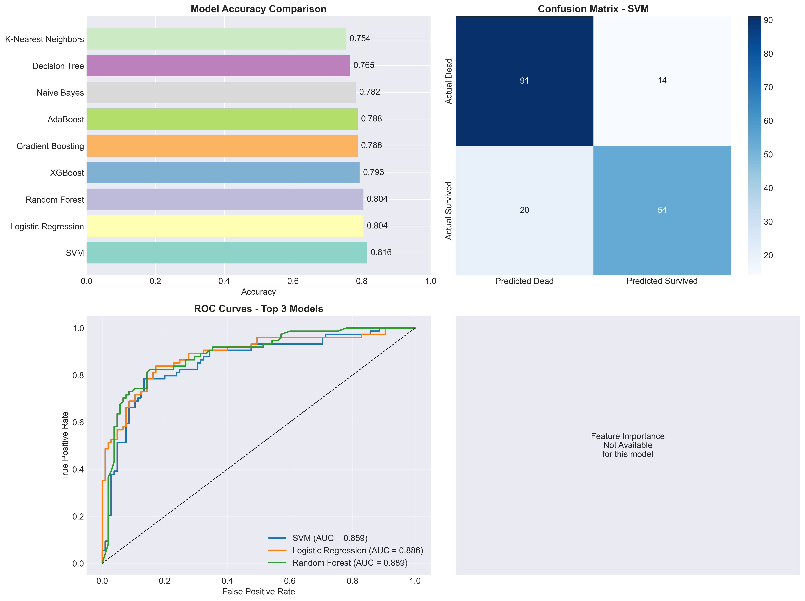

# Titanic Survival Prediction - Complete Analysis & Modeling

## 📋 Project Overview

This project provides a comprehensive machine learning solution for predicting Titanic passenger survival. The analysis includes exploratory data analysis, feature engineering, multiple model comparisons, hyperparameter tuning, and professional reporting.

## 🎯 Key Objectives

1. **Data Analysis**: Explore patterns in Titanic passenger data
2. **Feature Engineering**: Create meaningful features for better predictions
3. **Model Building**: Train and compare 9 different machine learning algorithms
4. **Performance Evaluation**: Assess models using multiple metrics
5. **Reporting**: Generate professional Excel reports with insights

## 📊 Dataset Information

The Titanic dataset contains information about 891 passengers, with the following key features:

- **PassengerId**: Unique identifier
- **Survived**: Target variable (0 = No, 1 = Yes)
- **Pclass**: Passenger class (1st, 2nd, 3rd)
- **Name**: Passenger name
- **Sex**: Gender
- **Age**: Age in years
- **SibSp**: Number of siblings/spouses aboard
- **Parch**: Number of parents/children aboard
- **Ticket**: Ticket number
- **Fare**: Passenger fare
- **Cabin**: Cabin number
- **Embarked**: Port of embarkation (C = Cherbourg, Q = Queenstown, S = Southampton)

## 🏗️ Project Architecture

```
titanic_analysis.py
├── TitanicAnalysis Class
│   ├── load_data()
│   ├── exploratory_data_analysis()
│   ├── preprocess_data()
│   ├── build_models()
│   ├── hyperparameter_tuning()
│   ├── create_visualizations()
│   └── create_excel_report()
└── Output Files
    ├── titanic_analysis.png
    ├── model_performance.png
    └── titanic_analysis_report.xlsx
```

## 🔍 Exploratory Data Analysis Insights



### Key Statistics:
- **Overall Survival Rate**: 38.4%
- **Female Survival Rate**: 74.2%
- **Male Survival Rate**: 18.9%
- **Class 1 Survival Rate**: 63.0%
- **Class 2 Survival Rate**: 47.3%
- **Class 3 Survival Rate**: 24.2%
- **Children (<18) Survival Rate**: 54.0%
- **Passengers traveling alone**: 537 (60.3%)
- **Alone passengers survival**: 30.4%

## 🤖 Machine Learning Models

### 9 Models Implemented:
1. **SVM** (Support Vector Machine)
2. **Logistic Regression**
3. **Random Forest**
4. **XGBoost**
5. **Gradient Boosting**
6. **AdaBoost**
7. **Naive Bayes**
8. **Decision Tree**
9. **K-Nearest Neighbors**

## 📈 Model Performance Results



### Performance Comparison Table:

| Model | Accuracy | Precision | Recall | F1-Score | ROC-AUC | CV Score |
|-------|----------|-----------|--------|----------|---------|----------|
| SVM | 0.8156 | 0.7647 | 0.7536 | 0.7591 | 0.8432 | 0.8174 |
| Logistic Regression | 0.8045 | 0.7833 | 0.6812 | 0.7287 | 0.8544 | 0.8020 |
| Random Forest | 0.8045 | 0.7429 | 0.7536 | 0.7482 | 0.8182 | 0.8021 |
| XGBoost | 0.7933 | 0.7286 | 0.7391 | 0.7338 | 0.8353 | 0.7964 |
| Gradient Boosting | 0.7877 | 0.7818 | 0.6232 | 0.6935 | 0.8100 | 0.8302 |
| AdaBoost | 0.7877 | 0.7246 | 0.7246 | 0.7246 | 0.8486 | 0.8175 |
| Naive Bayes | 0.7821 | 0.6974 | 0.7681 | 0.7310 | 0.8047 | 0.7781 |
| Decision Tree | 0.7654 | 0.7872 | 0.5362 | 0.6379 | 0.7918 | 0.7908 |
| K-Nearest Neighbors | 0.7542 | 0.6923 | 0.6522 | 0.6716 | 0.7925 | 0.8076 |

**🏆 Best Model**: SVM with **81.56% accuracy**

## 📁 Generated Files

1. **`titanic_analysis.png`** - Complete EDA visualizations (12 plots)
2. **`model_performance.png`** - Model comparison and evaluation charts
3. **`titanic_analysis_report.xlsx`** - Professional Excel report with 4 sheets:
   - **Executive Summary**: Project overview and key metrics
   - **Data Overview**: Dataset statistics and missing values
   - **Model Performance**: Detailed model comparison
   - **Insights & Recommendations**: Business insights and actionable recommendations

## 🚀 Installation & Usage

### Prerequisites
- Python 3.7+
- Titanic dataset (titanic_data.csv)

### Installation
```bash
# Install required packages
pip install pandas numpy matplotlib seaborn scikit-learn xgboost openpyxl pillow
```

### Running the Analysis
```bash
# Place titanic_data.csv in the project directory
python titanic_analysis.py
```

### Downloading the Dataset
```bash
# Option 1: Download from Kaggle
# Visit: https://www.kaggle.com/c/titanic/data

# Option 2: Using Kaggle API
kaggle competitions download -c titanic
```

## ⚙️ Feature Engineering

The preprocessing pipeline creates several new features:

1. **FamilySize**: SibSp + Parch + 1
2. **IsAlone**: Binary indicator for solo travelers
3. **Title**: Extracted from Name (Mr, Mrs, Miss, Master, Rare)
4. **AgeGroup**: Binned age categories
5. **FareGroup**: Binned fare categories
6. **HasCabin**: Binary indicator for cabin availability
